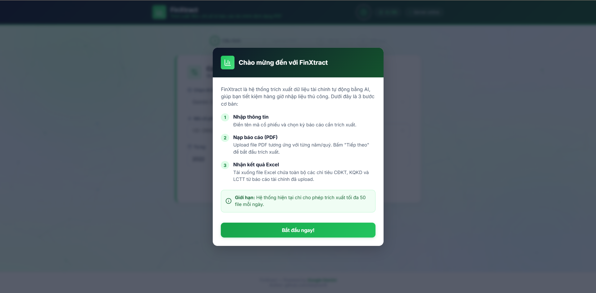

# 🚀 FinXtract: Automated Financial Statement Data Extraction



Watch demo: [youtu.be/Vn57We2R5Ik](https://youtu.be/Vn57We2R5Ik)

## 📖 Bối cảnh & Vấn đề

Chuyên gia phân tích tài chính (Financial Analysts) thường xuyên đối mặt với những rào cản lớn khi thu thập và xử lý số liệu:

- **Giới hạn từ nền tảng mở:** Các trang web dữ liệu chứng khoán thường giới hạn việc tải dữ liệu (ví dụ: chỉ cho phép xuất dữ liệu tối đa 4 năm liên tiếp).
- **Thiếu hụt độ chi tiết:** Rất khó để lấy được đầy đủ tất cả các chỉ tiêu trên cả 3 bản báo cáo (Bảng Cân đối kế toán, Báo cáo Kết quả Kinh doanh, Báo cáo Lưu chuyển tiền tệ) nếu chỉ dùng các API miễn phí.
- **Tốn thời gian & Rủi ro sai số:** Để có dữ liệu sâu, chuyên gia buộc phải thu thập từng file Báo cáo tài chính (BCTC) từ các nguồn chính thống, đọc và nhập liệu thủ công rồi merge các bảng lại với nhau. Quá trình xử lý thủ công này có thể tốn đến nửa ngày làm việc cho một mã cổ phiếu và cực kỳ dễ dẫn đến sai số.

## 💡 Giải pháp FinXtract

**FinXtract** ra đời nhằm giải phóng sức lao động cho các chuyên gia tài chính. Thay vì cặm cụi nhập từng con số, người dùng chỉ việc nạp trực tiếp các file BCTC (định dạng PDF) gốc đã thu thập được vào hệ thống.

Sử dụng cơ chế kỹ thuật trích xuất đặc biệt kết hợp với sức mạnh của **Mô hình ngôn ngữ lớn đa phương thức (Multimodal LLM)** thế hệ mới – **Google Gemini 3.1 Flash Lite**:

- **Tốc độ đột phá:** Giúp các chuyên gia tiết kiệm tối đa thời gian xử lý dữ liệu lớn, biến nửa ngày làm việc thủ công xuống chỉ còn **15 phút** chờ đợi AI tự động làm thay.
- **Độ chính xác cao:** Khả năng nhận diện bảng biểu và hiểu ngữ cảnh tài chính giúp độ chính xác đạt ngưỡng **> 98%**, xử lý mượt mà cả các file PDF dạng scan ảnh.
- **Tự động chuẩn hóa:** Trả về kết quả cuối cùng là một file Excel đã được mapping sẵn chuẩn chỉnh theo format phân tích tài chính.

> **⚠️ Lưu ý:**
> Do đang trong giai đoạn thử nghiệm (MVP), hệ thống hiện chỉ giới hạn trích xuất tối đa **50 file BCTC/ngày** cho toàn cục hệ thống để đảm bảo tài nguyên máy chủ.

## ⚙️ Cơ chế thực thi & Tech Stack

### 🛠 Tech Stack

- **Frontend:** Vanilla HTML5, CSS3, JavaScript. Không sử dụng Framework nặng nề, tối ưu hóa tốc độ tải trang cực nhanh. Giao diện được thiết kế hiện đại (Modern UI, Glassmorphism), kết hợp thư viện `lucide-icons` và hiệu ứng nền `tsParticles`.
- **Backend:** Python (FastAPI) – Xử lý luồng dữ liệu bất đồng bộ (Asynchronous) hiệu suất cao.
- **AI Engine:** API Google Gemini (`gemini-3.1-flash-lite`) với cơ chế File API Native.
- **Xử lý Data:** Thư viện `openpyxl` và `pandas` để làm sạch, format Excel chuyên nghiệp.

### 🔄 Workflow Kỹ thuật

1. **Upload & Mapping:** Người dùng chọn/kéo thả các file PDF BCTC vào giao diện. Frontend tự động gắn kết các file này vào từng năm/quý tương ứng.
2. **Asynchronous Polling:** Frontend gọi API `/extract-pdf`. Backend nhận file, lưu vào bộ nhớ đệm và sử dụng Thread ngầm để đẩy trực tiếp lên Cloud qua **Gemini File API**. API trả về `job_id` ngay lập tức để Frontend liên tục thăm dò (poll) kết quả mà không làm đứng trình duyệt.
3. **Divide & Conquer Extraction:** Để tránh rào cản "ảo giác" (hallucination) của AI khi xử lý file quá dài, Backend chia nhỏ Prompt thành 3 luồng: trích xuất Bảng CĐKT, Báo cáo KQKD, và Báo cáo LCTT riêng biệt.
4. **Data Normalization:** Backend tự động chuẩn hóa dữ liệu tài chính (loại bỏ dấu phân cách hàng nghìn, định dạng số âm trong ngoặc đơn thành số dương tùy theo chuẩn phân tích).
5. **Excel Generation:** Gom toàn bộ dữ liệu các năm, đắp vào template Excel và trả về Frontend.
6. **Auto Cleanup:** Hủy bỏ toàn bộ file PDF tạm thời trên Server và trên Cloud của Google ngay sau khi trích xuất xong để đảm bảo quyền riêng tư và giải phóng tài nguyên.

## 🚀 Hướng dẫn Cài đặt 

### Yêu cầu hệ thống

- Python 3.10+

### 1. Cài đặt Backend

```bash
# Clone Repo và di chuyển vào thư mục backend
cd FinXtract/backend

# Tạo môi trường ảo (Virtual Environment)
python -m venv venv

# Kích hoạt môi trường ảo
# Trên Windows:
.\venv\Scripts\activate
# Trên Mac/Linux: 
source venv/bin/activate

# Cài đặt các thư viện cần thiết
pip install -r requirements.txt

# Tạo file .env và cấu hình API Key của Google
echo "GEMINI_API_KEY=your_google_api_key_here" > .env
```

### 2. Khởi chạy Backend

```bash
# Khởi chạy server FastAPI ở port 8002
python -m uvicorn app.main:app --host 127.0.0.1 --port 8002 --reload
```

### 3. Khởi chạy Frontend

Bạn có thể mở trực tiếp file `index.html` trong thư mục `frontend` trên trình duyệt, hoặc dùng một Local Web Server để chạy chuẩn chỉ hơn:

```bash
cd ../frontend
# Chạy bằng Python HTTP Server
python -m http.server 5500
```

Truy cập: `http://localhost:5500` và tận hưởng!

## 🔮 Tầm nhìn & Bước tiếp theo (Next Steps)

Sau khi cốt lõi "Khai thác dữ liệu tự động" (Data Extraction) đã hoàn thiện, bước tiến tiếp theo của FinXtract sẽ là:

- Phát triển các **Dashboard phân tích tài chính đặc thù** (BI Dashboards) được trực quan hóa ngay trên nền tảng Web dựa trên dữ liệu thô vừa lấy được.
- Tự động tính toán các chỉ số sức khỏe tài chính cốt lõi (Core Metrics): ROA, ROE, Hệ số nợ (D/E), Biên lợi nhuận gộp/ròng...
- Hỗ trợ so sánh nhanh hiệu năng của doanh nghiệp với các đối thủ cùng ngành (Peer Comparison).

---

*Developed by [tahpnart8] - Empowering Vietnamese Financial Analysts with AI.*
